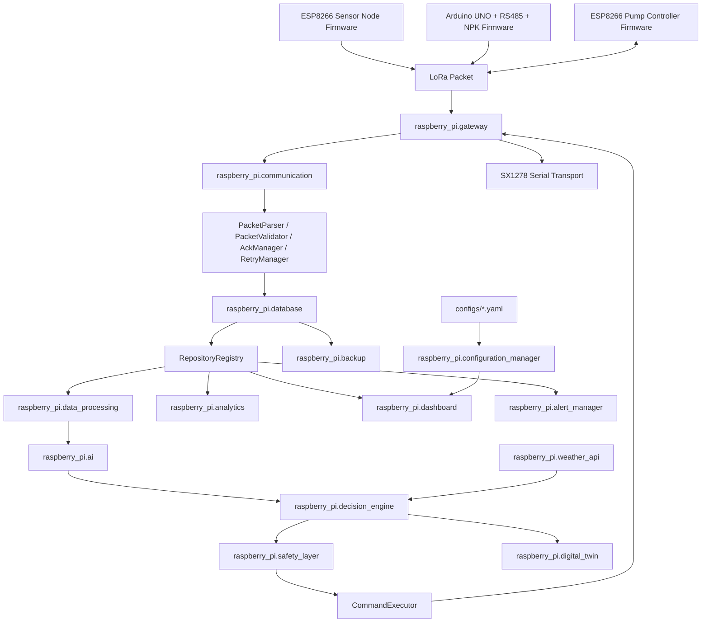

# Module Dependency Graph

## Runtime Dependency Map

## Status

All reported software integration gaps are resolved in existing modules. SX1278 radio behavior, pump ACK round trip, live sensor packets, and target TensorFlow inference are marked Hardware/Runtime Validation Required.
