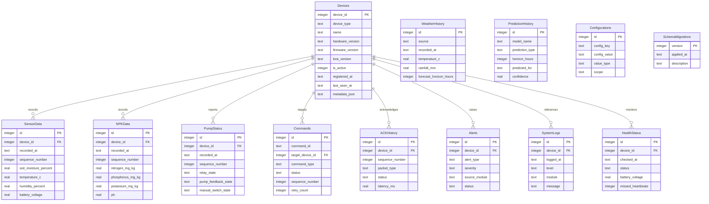

# Database Layer

## Scope

The database layer provides production-ready SQLite storage for the Raspberry Pi gateway. It supports automatic database creation, schema version migration, indexes, transactions, connection pooling, error recovery, automatic backup support, restore support, and database integrity checks.

This phase does not implement AI, dashboard, firmware, or decision engine behavior.

## Implemented Files

- `raspberry_pi/database/database.py`: Database facade for connection pool, migrations, repositories, backups, and integrity checks.
- `raspberry_pi/database/connection.py`: SQLite connection pool and transaction context managers.
- `raspberry_pi/database/schema.py`: Python schema constant and schema version.
- `raspberry_pi/database/schema.sql`: SQL schema for deployment review and manual inspection.
- `raspberry_pi/database/migration.py`: Versioned migration runner.
- `raspberry_pi/database/repository.py`: Repository classes for table access.
- `raspberry_pi/database/backup.py`: Backup, restore, latest-backup lookup, and integrity check support.
- `raspberry_pi/database/database_manager.py`: Application-level lifecycle manager.
- `raspberry_pi/database/query_builder.py`: Safe parameterized query builder helpers.

## Table Documentation

| Table | Purpose |
| --- | --- |
| `SchemaMigrations` | Tracks applied schema versions and migration timestamps. |
| `Devices` | Stores gateway, sensor node, NPK node, and pump controller identities and metadata. |
| `SensorData` | Stores soil moisture, DHT22 temperature/humidity, battery, RSSI, SNR, and raw payload data. |
| `NPKData` | Stores nitrogen, phosphorus, potassium, pH, EC, soil temperature, moisture, battery, RSSI, SNR, and raw payload data. |
| `PumpStatus` | Stores relay state, pump feedback, manual switch state, runtime, battery, RSSI, SNR, and raw payload data. |
| `Commands` | Stores outbound gateway commands, target device, status, retries, sequence number, and ACK state. |
| `ACKHistory` | Stores ACK, timeout, duplicate, latency, retry, packet type, device, and sequence history. |
| `WeatherHistory` | Stores weather observations and forecasts for later weather integration. |
| `PredictionHistory` | Stores future AI prediction outputs without implementing AI in this phase. |
| `Alerts` | Stores alert events from safety, communication, device health, and future modules. |
| `SystemLogs` | Stores structured application log records that need database persistence. |
| `Configurations` | Stores key/value configuration records with typed values and scope. |
| `HealthStatus` | Stores device health snapshots, heartbeat state, battery, RSSI, SNR, and error counts. |

## ER Diagram

## Operational Behavior

Automatic creation:

- Parent database directory is created before connections are opened.
- Migration version `1` creates all tables and indexes.

Transactions:

- `SQLiteConnectionPool.transaction()` wraps writes in `BEGIN`, `COMMIT`, and rollback on SQLite errors.

Connection pool:

- The pool uses multiple SQLite connections with WAL mode, foreign keys enabled, and busy timeout configured.

Backup and restore:

- Backups use the SQLite backup API for consistent copies.
- Restore closes the pool, copies the selected backup over the live database, and `DatabaseManager` recreates the database object.

Error recovery:

- Startup runs integrity checks on an existing database.
- If integrity fails and a backup exists, the newest backup is restored automatically.
- If integrity fails and no backup exists, startup raises an error instead of continuing with corrupt data.

